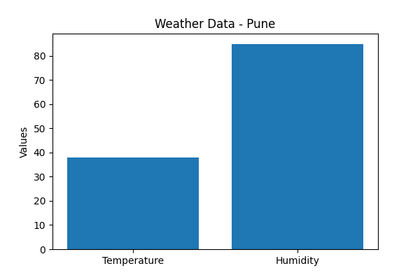

# Weather Forecast & Alert Application

A Python-based Weather Forecast & Alert Application that fetches real-time weather data using WeatherAPI and generates weather alerts, CSV reports, and visualization charts.

---

## Features

* Real-time weather monitoring
* Weather alert system
* Simulation mode
* CSV report generation
* Weather visualization charts
* API integration using WeatherAPI
* Beginner-friendly Python project

---

## Technologies Used

* Python
* WeatherAPI
* Requests
* Matplotlib
* Pandas
* Python Dotenv

---

## Project Structure

```text
Weather-Forecast-Alert-Application/
│
├── images/
├── outputs/
├── reports/
├── main.py
├── weather_chart.py
├── requirements.txt
├── README.md
├── .gitignore
└── .env
```

---

## Installation

Clone repository:

```bash
git clone https://github.com/Atharvbunde/Weather-Forecast-Alert-Application.git
```

Open project folder:

```bash
cd Weather-Forecast-Alert-Application
```

Install required libraries:

```bash
pip install -r requirements.txt
```

---

## API Setup

Create `.env` file:

```env
OPENWEATHER_API_KEY=YOUR_API_KEY
```

Get free API key from:

[WeatherAPI.com](https://www.weatherapi.com?utm_source=chatgpt.com)

---

## Run Project

```bash
py main.py
```

---

## Application Modes

### 1. Live API Mode

Fetches real-time weather data using WeatherAPI.

### 2. Simulation Mode

Runs project using sample weather data for testing.

---

## Output

The project generates:

* Weather alerts
* CSV weather reports
* Weather visualization charts

Generated files are stored inside:

```text
images/
outputs/
## Project Screenshots

### Weather Output


---

### Weather Visualization Chart



---

### Generated CSV Report


---

### Generated CSV Report 2


```

---

## Example Alerts

* High Temperature Alert
* Rain Alert
* Storm Alert
* High Humidity Alert

---

## Future Improvements

* Streamlit dashboard
* Voice assistant integration
* Email alert system
* 5-day weather forecast
* AI-based weather prediction

---

## Author

Atharv Bunde

GitHub Repository:

[Weather-Forecast-Alert-Application Repository](https://github.com/Atharvbunde/Weather-Forecast-Alert-Application?utm_source=chatgpt.com)
